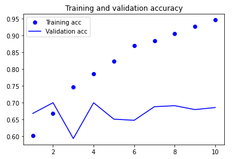
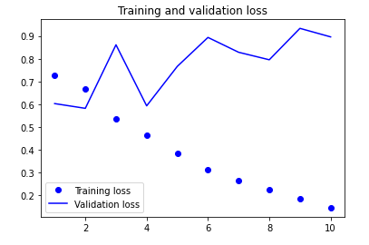
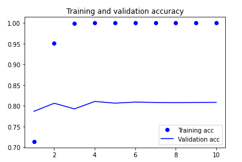
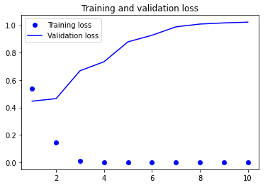

# EVA-Track3-Phase2-Session1
This repository contains assignment files of TSAI-EVA-Track3 course's Phase2 session1.

## Assignment
1. Refer to the code mentioned on pages: 182-195 of this [BOOK](http://faculty.neu.edu.cn/yury/AAI/Textbook/Deep%20Learning%20with%20Python.pdf)
2. Repeat the same code while adding code comments. 
3. Train the GLOVE based model with 8000 samples instead of 200. 

## Group Members

Atul Gupta (samatul@gmail.com)

Gaurav Patel (gaurav4664@gmail.com)

Ashutosh Panda (ashusai.panda@gmail.com)

## Files

**SessionP2S1-word-embeddings.ipynb**

**Case 1:
Using raw ImDB data with Pretrained Glove embeddings and embedding layer frozen.**

 <b>Accuracy Plot</b> 

 <b>Loss Plot</b> 

**Case 2:
Using raw ImDB data with Pretrained Glove embeddings without freezing embedding layer.**

 <b>Accuracy Plot</b> 

 <b>Loss Plot</b> 

